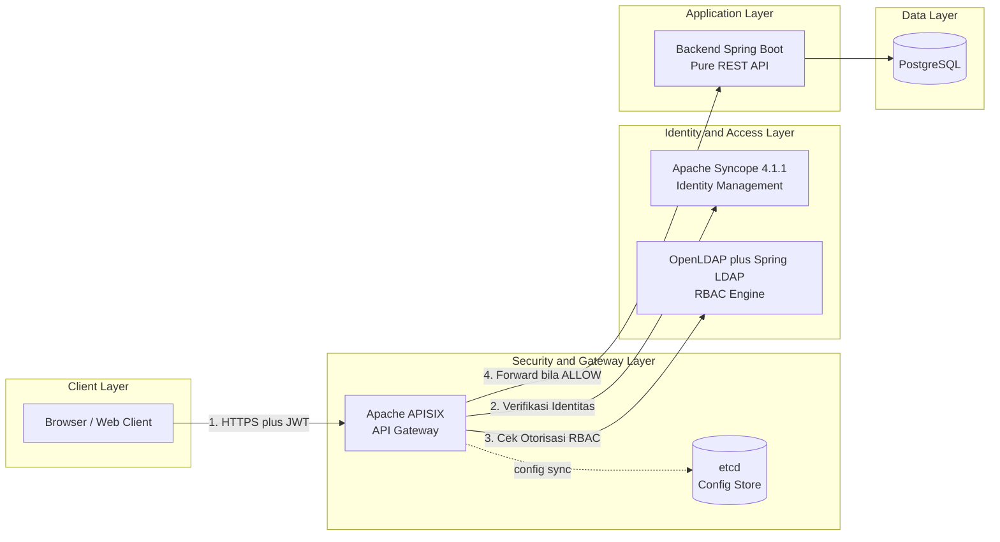
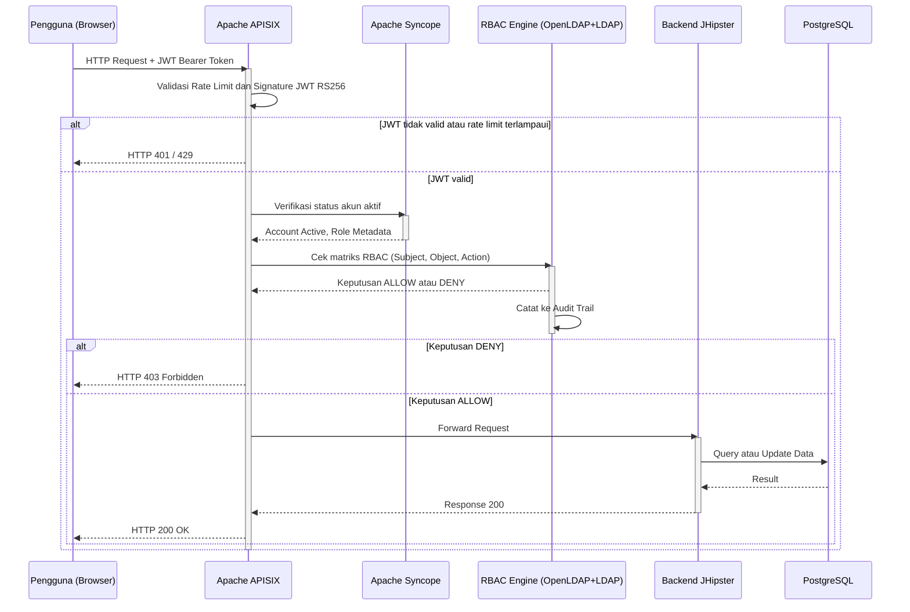
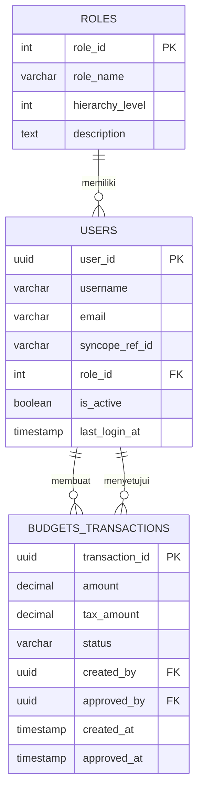

# Product Requirements Document (PRD)

## SIMPAX — Sistem Informasi Manajemen Pajak dan Keuangan

**Subjudul:** Arsitektur Keamanan pada OSI Layer 5 (Session), Layer 6 (Presentation), dan Layer 7 (Application) untuk Platform SaaS Keuangan Berbasis Zero Trust Architecture

---

### Document Control

| Atribut | Detail |
|---|---|
| Nama Dokumen | PRD - SIMPAX (Sistem Informasi Manajemen Pajak & Keuangan) |
| Versi | 1.1 |
| Tanggal Penyusunan | 18 Juni 2026 (revisi: 27 Juni 2026) |
| Status | Revisi — Disesuaikan dengan Realita Implementasi (lihat Catatan Revisi v1.1) |
| Konteks Akademik | Tugas Akhir Mata Kuliah Keamanan Jaringan, Program Studi Sistem Informasi |
| Peran Penyusun | Senior Product Manager dan Network Security Architect (simulasi peran akademik) |
| Klasifikasi Dokumen | Internal - Proof of Concept (PoC) |

### Catatan Revisi (v1.0 → v1.1)

PRD v1.0 disusun sebagai blueprint awal sebelum implementasi berjalan. Setelah audit kesesuaian kode vs dokumen (27 Juni 2026), beberapa asumsi awal terbukti berubah pada tahap implementasi. Prinsip yang dipegang pada revisi ini: **kode adalah source of truth**, sehingga PRD disesuaikan ke kode, bukan sebaliknya. Perubahan substantif:

| # | Bagian Terdampak | v1.0 (Asumsi Awal) | v1.1 (Sesuai Implementasi) |
|---|---|---|---|
| 1 | §4.1, §8.1 | Frontend dan Backend dibundel dalam satu monolith JHipster | Backend berjalan sebagai **pure REST API** (Spring Boot, skeleton awal dari JHipster); Frontend akan dibangun terpisah sebagai **Standalone React + Vite SPA** pada Tahap 6 |
| 2 | §6.3, §8.1, §10.2 | Apache Fortress sebagai RBAC engine | **OpenLDAP + Spring LDAP** sebagai model konseptual ANSI RBAC, menggantikan Fortress yang tidak kompatibel dengan Spring Boot 3.x (justifikasi sudah ada di §14.1 Risks v1.0) |
| 3 | §6.2 | Versi Apache Syncope tidak disebutkan eksplisit; dokumen kontrak integrasi awal mengasumsikan Syncope 3.x | Versi aktual yang terpasang adalah **Syncope 4.1.1** — lihat catatan kehati-hatian audit di §6.2 |
| 4 | §9.1, §11.2 | Contoh path API memakai prefix `/api/v1/**` | Implementasi aktual memakai `/api/auth/**` dan `/api/transactions/**` tanpa prefix versi |
| 5 | §10 | Belum ada entity untuk modul Saldo & Saham | Entity `WalletBalance`, `StockHolding`, `StockPriceCache` sudah ada di kode (domain + tabel Liquibase) namun **belum** memiliki Service/Controller — ditambahkan sebagai §10.5 |
| 6 | §10 | Belum ada desain tabel Audit Trail | Diusulkan skema `audit_log` minimal sebagai §10.6, karena tabel ini belum ada di Liquibase manapun |

Detail teknis lengkap untuk setiap poin di atas didokumentasikan di README repository (§5 "Audit Kesesuaian: Code vs README vs PRD").

### Daftar Isi

1. Executive Summary
2. Product Overview
3. Goals and Objectives
4. Project Scope
5. Core Features - Business Module
6. Core Features - Security Module
7. Pemetaan Kontrol Keamanan terhadap OSI Layer 5-7
8. System Architecture
9. User Flow dan Skenario
10. Database Design
11. Technical Requirements
12. Non-Functional Requirements dan Referensi Standar Industri
13. Design and UI/UX Strategy
14. Risks, Assumptions, and Mitigations
15. Glossary
16. Appendix - Referensi

---

## 1. Executive Summary

SIMPAX (Sistem Informasi Manajemen Pajak & Keuangan) adalah simulasi produk berbasis Software-as-a-Service (SaaS) yang mengintegrasikan fungsi pembukuan bisnis dengan kepatuhan pajak domestik untuk perusahaan swasta. Dokumen ini menjabarkan dua dimensi kebutuhan secara setara: dimensi bisnis (otomasi laporan keuangan, kalkulasi pajak, dan manajemen faktur) serta dimensi keamanan (arsitektur defense-in-depth yang secara eksplisit memetakan kontrolnya terhadap OSI Layer 5, 6, dan 7).

Pendekatan keamanan SIMPAX dibangun di atas tiga pilar teknologi open-source, yaitu Apache APISIX sebagai API Gateway, Apache Syncope sebagai Identity and Access Management (IAM), dan Apache Fortress sebagai model konseptual mesin Role-Based Access Control (RBAC) — yang pada implementasi aktual direalisasikan melalui OpenLDAP + Spring LDAP karena alasan kompatibilitas (lihat §6.3 dan §14.1). Ketiganya disusun berlapis untuk merealisasikan prinsip Zero Trust Architecture, di mana setiap request - termasuk yang berasal dari jaringan internal kantor - tetap divalidasi ulang secara end-to-end sebelum diberikan akses terhadap resource.

Dokumen PRD ini disusun agar dapat berfungsi ganda: sebagai laporan akademik yang merepresentasikan pemahaman konsep keamanan jaringan pada lapisan atas model OSI, sekaligus sebagai panduan teknis pengembangan (technical blueprint) yang dapat langsung diacu oleh tim pengembang saat membangun lingkungan simulasi berbasis JHipster dan Docker.

## 2. Product Overview

### 2.1 Problem Statement

Perusahaan swasta skala kecil hingga menengah pada umumnya masih mengelola pembukuan dan kepatuhan pajak secara manual atau melalui kombinasi spreadsheet yang terpisah dari sistem otorisasi formal. Kondisi ini menimbulkan dua kelas masalah yang saling berkaitan. Pada sisi operasional, proses manual rentan terhadap keterlambatan pelaporan dan kesalahan kalkulasi pajak akibat perubahan tarif yang tidak terpantau secara konsisten. Pada sisi keamanan dan governance, ketiadaan pemisahan tugas (Separation of Duties) yang terstruktur antara pihak yang menginput transaksi dan pihak yang menyetujui pencairan dana membuka risiko fraud internal yang sulit dideteksi tanpa audit trail yang memadai.

SIMPAX diposisikan untuk menjawab kedua kelas masalah tersebut secara simultan: otomasi pada lapisan bisnis, dan strict access control pada lapisan keamanan.

### 2.2 Definisi Produk

SIMPAX adalah solusi keuangan berbasis SaaS yang mengintegrasikan pembukuan bisnis dengan kepatuhan pajak. Produk ini membantu akuntan perusahaan swasta memproses kwitansi, menghitung PPN/PPh secara otomatis, serta menyusun laporan laba rugi tanpa kehilangan jejak audit atas siapa yang melakukan apa terhadap data keuangan tersebut.

### 2.3 Target User dan Persona

**Persona 1 - Staf Proyek (Input Transaksi)**
Tujuan utamanya adalah mencatat transaksi harian secara cepat dan akurat. Pain point yang dialami pada proses lama adalah tingginya risiko duplikasi dan kesalahan input manual. Pada SIMPAX, persona ini memiliki hak akses create terhadap kwitansi dan faktur digital, namun tidak memiliki kewenangan approval.

**Persona 2 - Manajer Keuangan (Approval Pencairan)**
Tujuan utamanya adalah memvalidasi dan menyetujui pencairan dana sesuai kebijakan internal perusahaan. Pain point yang dialami adalah minimnya visibilitas real-time terhadap status approval yang menumpuk. Pada SIMPAX, persona ini memiliki hak akses approve/reject terhadap transaksi serta akses penuh terhadap dashboard arus kas.

**Persona 3 - Auditor/Admin Security**
Tujuan utamanya adalah memastikan kepatuhan kontrol akses serta mendeteksi anomali secara dini. Pain point yang dialami pada sistem lama adalah audit trail yang tersebar di berbagai sistem sehingga menyulitkan proses investigasi. Pada SIMPAX, persona ini memiliki hak akses read-only terhadap seluruh log dan kelola identitas/role, namun secara prinsip Separation of Duties, persona ini sengaja tidak diberikan kewenangan untuk memproses transaksi bisnis itu sendiri agar tidak menimbulkan conflict of interest pada peran pengawasannya.

## 3. Goals and Objectives

### 3.1 Business Goals

Tujuan bisnis SIMPAX mencakup otomatisasi penyusunan laporan keuangan agar tersedia secara real-time, peningkatan efisiensi manajemen kas melalui visibilitas terpusat, serta akurasi kalkulasi pajak domestik (PPN dan PPh) yang konsisten dengan regulasi yang berlaku.

### 3.2 Security Goals

Tujuan keamanan SIMPAX merujuk pada tiga prinsip utama. Pertama, penerapan Zero Trust Architecture sebagaimana dikonsepkan pada NIST Special Publication 800-207, yaitu prinsip "never trust, always verify" di mana lokasi jaringan (misalnya IP kantor) tidak pernah dijadikan satu-satunya dasar kepercayaan tanpa verifikasi identitas dan otorisasi tambahan. Kedua, penerapan Strict Separation of Duties (SoD) untuk mencegah satu individu memiliki kombinasi kewenangan yang berpotensi disalahgunakan untuk fraud. Ketiga, pencegahan serangan pada lapisan API (API abuse, brute-force, dan request flooding) melalui kontrol yang diterapkan pada API Gateway.

### 3.3 Success Metrics

| Metrik | Target | Kategori |
|---|---|---|
| Akurasi kalkulasi pajak (PPN/PPh) dibanding regulasi resmi yang berlaku | 100 persen | Business |
| Waktu penyusunan laporan laba rugi dibanding proses manual | Tersedia real-time, tanpa proses rekapitulasi manual harian | Business |
| Tingkat keberhasilan validasi RBAC pada seluruh test case ALLOW/DENY yang didefinisikan | 100 persen sesuai matriks otorisasi | Security |
| Mean Time to Detect (MTTD) percobaan akses tidak sah melalui Audit Trail | Tercatat kurang dari satu menit setelah kejadian | Security |
| Tingkat keberhasilan rate limiting menahan simulasi request flooding pada endpoint login | 100 persen request di atas threshold ditolak dengan HTTP 429 | Security |

Catatan: ketiga metrik kategori Security pada tabel di atas tidak didefinisikan secara eksplisit pada spesifikasi awal proyek, namun ditambahkan dalam dokumen ini sebagai praktik standar Product Management agar setiap Security Goal pada bagian 3.2 memiliki ukuran keberhasilan yang dapat diverifikasi secara objektif saat pengujian PoC.

## 4. Project Scope

### 4.1 In Scope

Cakupan pengembangan PoC ini meliputi pengembangan backend menggunakan Spring Boot (skeleton awal dari JHipster, kini berjalan sebagai pure REST API) dan frontend Standalone React + Vite SPA terpisah, konfigurasi routing serta kebijakan keamanan pada Apache APISIX, implementasi Identity and Access Management menggunakan Apache Syncope, implementasi Role-Based Access Control menggunakan OpenLDAP + Spring LDAP (model konseptual ANSI RBAC, menggantikan Apache Fortress — lihat §14.1), serta kalkulasi pajak internal (PPN dan PPh) yang murni bersifat simulatif. _(Direvisi pada v1.1, lihat Catatan Revisi)_

### 4.2 Out of Scope

Cakupan ini secara eksplisit tidak mencakup integrasi dengan sistem Core Banking riil maupun payment gateway asli. Seluruh perubahan status pembayaran dan pencairan dana dalam PoC ini merupakan simulasi update row pada database lokal, tanpa konsekuensi finansial nyata.

## 5. Core Features - Business Module

| Fitur | Deskripsi | Prioritas |
|---|---|---|
| Dasbor Arus Kas dan Laba Rugi Real-Time | Visualisasi cash flow dan profit/loss statement secara real-time berdasarkan transaksi yang telah melalui proses otorisasi | Must Have |
| Kalkulator Pajak Otomatis | Menghitung PPN 11 persen serta PPh 21/23/Final secara otomatis dan menghasilkan draft e-Faktur | Must Have |
| Modul Kwitansi dan Faktur Digital | Penomoran otomatis, tracking status pembayaran, serta pengiriman dokumen via email dan WhatsApp | Must Have |

## 6. Core Features - Security Module

Bagian ini merupakan inti dari PRD mengingat fokus mata kuliah Keamanan Jaringan terletak pada bagaimana ketiga komponen di bawah ini saling melengkapi dalam satu rantai kepercayaan (chain of trust) yang utuh.

### 6.1 Apache APISIX (API Gateway)

| Kapabilitas | Deskripsi Implementasi |
|---|---|
| Rate Limiting dan Anti-DDoS | Plugin limit-count atau limit-req diterapkan per kelompok endpoint untuk mencegah brute-force dan request flooding |
| Otentikasi API Token | Plugin jwt-auth digunakan untuk validasi JWT bertanda tangan RS256; plugin openid-connect digunakan untuk mendukung alur OAuth2 |
| Transformasi Data | Plugin proxy-rewrite dan response-rewrite digunakan untuk normalisasi header serta body request/response antar service |
| IP Whitelisting | Plugin ip-restriction diterapkan khusus pada route modul pajak (/api/tax/**, direncanakan Tahap 6) agar hanya dapat diakses dari rentang IP kantor |

### 6.2 Apache Syncope (Identity Management)

| Kapabilitas | Deskripsi Implementasi |
|---|---|
| User Lifecycle | Mendukung proses onboarding (provisioning akun baru) dan offboarding (deaktivasi serta pencabutan akses) secara terpusat |
| Single Sign-On (SSO) | Otentikasi terpusat sehingga satu kredensial dapat digunakan lintas seluruh modul SIMPAX |
| Kebijakan Sandi Kuat (Strong Password Policy) | Mendefinisikan panjang minimum, kompleksitas karakter, riwayat sandi (password history), dan periode rotasi sandi |
| Multi-Factor Authentication (MFA) | Lapisan verifikasi tambahan, khususnya diwajibkan untuk role dengan kewenangan approval keuangan |

Catatan teknis: Apache Syncope secara inti (core) lebih berperan sebagai platform Identity Lifecycle Management dan provisioning identitas. Untuk kapabilitas SSO berbasis protokol terbuka (OIDC/SAML) dan MFA, konfigurasi yang lebih matang umumnya melibatkan integrasi dengan Identity Provider eksternal atau modul tambahan pada ekosistem Syncope. Asumsi ini sebaiknya dicantumkan secara eksplisit pada bagian Risks (Bab 14) agar tidak menimbulkan ekspektasi yang melebihi kapabilitas out-of-the-box pada saat implementasi.

> **Catatan Revisi v1.1 — Versi Syncope aktual:** Dokumen kontrak integrasi awal antara Backend dan Syncope (`kontrak_integrasi_syncope.md`) ditulis dengan asumsi Syncope 3.x. Konfirmasi dari Security & Config Engineer (26 Juni 2026) menyatakan versi yang benar-benar terpasang adalah **Syncope 4.1.1**, dan endpoint `/syncope/rest/accessTokens/login` tetap berfungsi pada versi tersebut. Selisih dua versi major (3.x → 4.1.1) cukup signifikan sehingga **tidak boleh diasumsikan otomatis backward-compatible** untuk endpoint lain yang belum diuji eksplisit (misalnya endpoint terkait password policy atau schema management) — perbedaan versi sebesar ini berpotensi membawa breaking change di luar dua endpoint yang sudah diverifikasi (login dan create user).
>
> **Catatan Audit — Update Status Verifikasi (27 Juni 2026):** Status pada dokumen kontrak integrasi sebelumnya bersifat *self-reported* tanpa artefak bukti independen. Gap ini sudah **ditutup**: pengujian end-to-end langsung (`psql -lqt` mengonfirmasi database `syncope` ada; log startup Syncope bersih tanpa error koneksi; `POST /api/auth/register` → `201 Created` dengan `userId` UUID; `POST /api/auth/login` dengan kredensial yang sama → `200 OK` dengan JWT RS256 berisi `userId` yang cocok) membuktikan integrasi Syncope 4.1.1 benar-benar berfungsi, bukan sekadar checklist. Prinsip *compliance evidence* COBIT 2019 MEA04 kini terpenuhi untuk dua endpoint inti ini (login dan create user). Endpoint Syncope lain yang belum pernah dipanggil (password policy, schema management, dsb.) tetap belum boleh diasumsikan otomatis kompatibel jika suatu saat dibutuhkan.

### 6.3 RBAC Engine — OpenLDAP + Spring LDAP _(direvisi dari rencana awal Apache Fortress, lihat §14.1)_

| Kapabilitas | Deskripsi Implementasi |
|---|---|
| Separation of Duties (SoD) | Static SoD mencegah satu user memegang kombinasi role yang berisiko fraud, misalnya staf input transaksi yang sekaligus menjadi approver |
| Otorisasi Granular | Matriks permission mengacu pada standar ANSI INCITS 359 RBAC: Staf Gudang bersifat read-only, Akuntan dapat create/edit, Direksi memiliki full access |
| Audit Trail Tersentralisasi | Mencatat setiap keputusan ALLOW maupun DENY beserta identitas pemohon, waktu kejadian, dan resource yang diakses |

> **Catatan implementasi:** Apache Fortress yang direncanakan pada PRD v1.0 tidak kompatibel dengan Spring Boot 3.x dan terindikasi telah berstatus Apache Attic (retired). Sebagai gantinya, struktur role (STAFF/MANAGER/AUDITOR/DIREKSI) disimpan di **OpenLDAP** dan dievaluasi melalui **Spring LDAP** pada `FortressRbacService` di level backend — model konseptual ANSI RBAC tetap dipertahankan, hanya mesin eksekusinya yang berbeda dari rencana awal. Kapabilitas tabel di atas tetap relevan secara konseptual.

## 7. Pemetaan Kontrol Keamanan terhadap OSI Layer 5-7

Tabel berikut memetakan setiap kontrol keamanan SIMPAX terhadap tanggung jawab fungsional tiga layer teratas model OSI, sesuai fokus mata kuliah.

| OSI Layer | Nama Layer | Komponen dan Kontrol SIMPAX | Justifikasi Fungsional |
|---|---|---|---|
| Layer 7 | Application | RBAC Engine (OpenLDAP + Spring LDAP, model konseptual Apache Fortress; keputusan ALLOW/DENY berbasis RBAC); Apache APISIX (rate limiting per endpoint, IP whitelisting pada route bisnis) | Keputusan otorisasi granular terhadap resource dan operasi bisnis spesifik (budgets, invoices) merupakan tanggung jawab logika aplikasi |
| Layer 6 | Presentation | Signing dan verifikasi JWT (RS256); transformasi payload request/response pada APISIX; terminasi TLS di gateway | Berkaitan dengan representasi, encoding, kompresi, dan keamanan format data sebelum diinterpretasikan oleh logika aplikasi |
| Layer 5 | Session | Apache Syncope (validasi status akun aktif, manajemen SSO); siklus hidup token OAuth2; kebijakan session timeout | Mengelola pembentukan, kontinuitas, sinkronisasi, dan terminasi sesi pengguna lintas request HTTP yang secara alami bersifat stateless |

**Catatan Kritis terhadap Pemetaan:** model OSI secara historis dirancang untuk konteks komunikasi data jaringan klasik berbasis protokol seperti NetBIOS atau RPC pada Session Layer, dan ASCII/EBCDIC encoding murni pada Presentation Layer. Pada arsitektur web modern berbasis HTTP/REST, seluruh mekanisme di atas (JWT, OAuth2, RBAC) secara teknis berjalan di atas protokol HTTP yang dalam model TCP/IP modern keseluruhannya dikategorikan sebagai Application Layer. Oleh karena itu, pemetaan terhadap Layer 5 dan Layer 6 pada tabel di atas bersifat konseptual-fungsional berdasarkan tanggung jawab yang dijalankan (representasi data dan kontinuitas sesi), bukan pemetaan protokol literal terhadap implementasi OSI klasik. Pencantuman catatan ini penting agar penilai akademik memahami bahwa mahasiswa menyadari nuansa tersebut, bukan menganggap JWT secara literal berjalan sebagai protokol Session Layer dalam pengertian OSI murni.

## 8. System Architecture

### 8.1 Technical Stack

| Layer | Teknologi | Fungsi Utama |
|---|---|---|
| Frontend | React + Vite (Standalone SPA) _(direvisi dari rencana JHipster monolith)_ | Antarmuka pengguna berbasis Single Page Application, terpisah penuh dari backend, mengonsumsi REST API via APISIX |
| Backend | Spring Boot (skeleton awal dari JHipster, berjalan sebagai pure REST API) | Business logic dan REST API |
| API Gateway | Apache APISIX | Reverse proxy, rate limiting, validasi JWT, transformasi data |
| Gateway Config Store | etcd | Penyimpanan konfigurasi route dan plugin APISIX secara terdistribusi |
| Identity Management | Apache Syncope 4.1.1 | User lifecycle, validasi kredensial login, kebijakan sandi |
| Authorization Engine | OpenLDAP + Spring LDAP _(direvisi dari Apache Fortress, lihat §6.3 dan §14.1)_ | RBAC, Separation of Duties, audit trail |
| Database | PostgreSQL | Persistensi data transaksional |
| Containerization | Docker dan Docker Compose | Orkestrasi seluruh layanan pada environment lokal |

### 8.2 Architecture Diagram

### 8.3 Data Flow / Request Lifecycle

Alur lalu lintas data SIMPAX dirancang sebagai rantai verifikasi berlapis, di mana setiap titik (hop) memiliki kewenangan untuk menghentikan request apabila satu kondisi keamanan tidak terpenuhi.

1. Browser mengirimkan HTTP Request yang membawa header Authorization berisi JWT Bearer Token.
2. Apache APISIX menerima request dan melakukan dua validasi awal secara berurutan: validasi rate limit dan validasi signature/claims pada JWT (algoritma RS256).
3. Apabila lolos, APISIX meneruskan permintaan verifikasi identitas ke Apache Syncope untuk memastikan status akun masih aktif dan mengambil metadata role terbaru milik pemohon.
4. APISIX meneruskan konteks identitas tersebut ke RBAC Engine (OpenLDAP + Spring LDAP, model konseptual Apache Fortress — lihat §6.3) untuk dievaluasi terhadap matriks RBAC berdasarkan kombinasi Subject, Object, dan Action.
5. RBAC Engine mengembalikan keputusan ALLOW atau DENY, sekaligus mencatatnya ke Audit Trail tanpa memandang hasil keputusannya.
6. Apabila ALLOW, APISIX meneruskan request ke Backend JHipster, yang kemudian menjalankan business logic dan berinteraksi dengan PostgreSQL.
7. Response dikembalikan melalui APISIX menuju Browser. Apabila DENY, APISIX langsung memutus koneksi dengan HTTP 403 Forbidden tanpa request tersebut pernah mencapai Backend, sehingga permukaan serangan (attack surface) terhadap business logic tetap minimal.

## 9. User Flow dan Skenario

### 9.1 Skenario A - Akses Ditolak (Denied)

Staf Akuntansi mencoba mengakses endpoint POST /api/transactions/{id}/approve. Validasi JWT pada APISIX berhasil, dan Apache Syncope mengidentifikasi role pemohon sebagai Staf. RBAC Engine (OpenLDAP + Spring LDAP) kemudian menolak izin (DENY) karena role Staf tidak memenuhi syarat matriks otorisasi untuk operasi approve, yang hanya diperuntukkan bagi role Manajer. APISIX selanjutnya memutus koneksi dengan respons HTTP 403 Forbidden, dan keputusan DENY tersebut tercatat pada Audit Trail.

### 9.2 Skenario B - Akses Disetujui (Approved)

Manajer Keuangan menekan tombol Approve. Token dan rate limit lolos validasi APISIX, Apache Syncope mengonfirmasi akun masih aktif, dan RBAC Engine (OpenLDAP + Spring LDAP) memberikan izin (ALLOW) karena role Manajer memenuhi syarat operasi approve. Backend kemudian memperbarui status transaksi pada database, dan keputusan tersebut disimpan ke Audit Trail.

## 10. Database Design

### 10.1 Entity Relationship Diagram

### 10.2 Skema Tabel roles

Tabel ini merepresentasikan hierarki otorisasi yang dievaluasi oleh RBAC Engine (OpenLDAP + Spring LDAP, model konseptual ANSI RBAC — lihat §6.3).

| Kolom | Tipe Data | Constraint | Deskripsi |
|---|---|---|---|
| role_id | SERIAL | PRIMARY KEY | Identifier unik role |
| role_name | VARCHAR(50) | NOT NULL, UNIQUE | Nama role, contoh: STAFF, MANAGER, AUDITOR, DIREKSI |
| hierarchy_level | INT | NOT NULL | Level hierarki otorisasi; semakin tinggi nilai, semakin tinggi privilege |
| description | TEXT | NULLABLE | Deskripsi tanggung jawab role |

### 10.3 Skema Tabel users

Tabel ini menjadi referensi lokal terhadap identitas yang sumber kebenarannya (source of truth) berada pada Apache Syncope.

| Kolom | Tipe Data | Constraint | Deskripsi |
|---|---|---|---|
| user_id | UUID | PRIMARY KEY | Identifier unik user pada SIMPAX |
| username | VARCHAR(100) | NOT NULL, UNIQUE | Username login |
| email | VARCHAR(150) | NOT NULL, UNIQUE | Alamat email user |
| syncope_ref_id | VARCHAR(100) | NOT NULL, UNIQUE | Referensi terhadap identity record pada Apache Syncope |
| role_id | INT | FOREIGN KEY REFERENCES roles(role_id) | Role yang melekat pada user |
| is_active | BOOLEAN | NOT NULL, DEFAULT TRUE | Status aktif/nonaktif akun, disinkronkan dari Syncope |
| last_login_at | TIMESTAMP | NULLABLE | Waktu login terakhir |

### 10.4 Skema Tabel budgets_transactions

| Kolom | Tipe Data | Constraint | Deskripsi |
|---|---|---|---|
| transaction_id | UUID | PRIMARY KEY | Identifier unik transaksi |
| amount | DECIMAL(18,2) | NOT NULL | Nilai transaksi sebelum pajak |
| tax_amount | DECIMAL(18,2) | NOT NULL | Nilai pajak hasil kalkulasi otomatis (PPN/PPh) |
| status | VARCHAR(20) | NOT NULL, DEFAULT 'PENDING' | Status transaksi: PENDING, APPROVED, atau REJECTED |
| created_by | UUID | FOREIGN KEY REFERENCES users(user_id) | User yang menginput transaksi |
| approved_by | UUID | FOREIGN KEY REFERENCES users(user_id), NULLABLE | User (Manajer Keuangan) yang menyetujui transaksi |
| created_at | TIMESTAMP | NOT NULL, DEFAULT now() | Waktu input transaksi |
| approved_at | TIMESTAMP | NULLABLE | Waktu approval transaksi |

### 10.5 Skema Tabel Saldo & Saham _(ditambahkan pada v1.1 — entity sudah ada di kode, belum terdokumentasi di v1.0)_

> **Catatan Revisi:** entity `WalletBalance`, `StockHolding`, dan `StockPriceCache` sudah ada di domain backend serta tabelnya sudah dibuat melalui Liquibase, namun **belum** memiliki Service maupun Controller yang men-expose-nya ke REST API. Skema di bawah merangkum struktur yang sudah ada di kode agar PRD tidak lagi tertinggal dari implementasi.

| Tabel | Kolom Kunci | Deskripsi |
|---|---|---|
| wallet_balance | wallet_id (PK), user_id (FK), balance, currency, updated_at | Menyimpan saldo kas per user/akun, sumber data untuk Dasbor Arus Kas |
| stock_holding | holding_id (PK), user_id (FK), stock_symbol, quantity, average_price | Menyimpan posisi kepemilikan saham per user |
| stock_price_cache | symbol (PK), last_price, fetched_at | Cache harga saham terbaru agar tidak memanggil API harga eksternal pada setiap request |

Pekerjaan yang tersisa untuk modul ini (diprioritaskan di awal Tahap 6 karena entity paling siap): membangun `WalletBalanceService`/`Controller`, `StockHoldingService`/`Controller`, dan job penyegaran `stock_price_cache`, lalu mengintegrasikannya ke Dasbor Arus Kas pada §5.

### 10.6 Skema Tabel Audit Trail _(usulan, ditambahkan pada v1.1)_

PRD v1.0 menyebutkan Audit Trail tersentralisasi sebagai kapabilitas inti (§6.3) dan dirujuk pada ISO/IEC 27001 Annex A (§12), namun belum ada tabel yang merealisasikannya di Liquibase manapun. Skema minimal berikut diusulkan agar setiap keputusan ALLOW/DENY memiliki jejak yang dapat ditelusuri (relevan dengan COBIT 2019 MEA04):

| Kolom | Tipe Data | Constraint | Deskripsi |
|---|---|---|---|
| id | UUID | PRIMARY KEY | Identifier unik baris log |
| actor_username | VARCHAR(100) | NOT NULL | Subjek dari klaim JWT (`sub`) |
| actor_role | VARCHAR(50) | NOT NULL | Role aktif saat request dilakukan |
| action | VARCHAR(100) | NOT NULL | Misal `CREATE_TRANSACTION`, `APPROVE_TRANSACTION` |
| resource | VARCHAR(150) | NOT NULL | Endpoint atau entity yang diakses |
| decision | VARCHAR(10) | NOT NULL | `ALLOW` atau `DENY` |
| reason | VARCHAR(255) | NULLABLE | Pesan spesifik saat DENY, misal hasil `checkAccess()` |
| ip_address | VARCHAR(45) | NULLABLE | Untuk korelasi dengan log APISIX |
| created_at | TIMESTAMP | NOT NULL, DEFAULT now() | Waktu kejadian |

Disarankan skema ini dirampungkan sebelum modul bisnis baru (Kalkulator Pajak, Kwitansi & Faktur) ditambahkan, supaya setiap entity baru langsung terintegrasi dengan pencatatan audit sejak awal.

## 11. Technical Requirements

### 11.1 Infrastruktur

Environment pengembangan dan pengujian dijalankan pada Docker Lokal melalui satu berkas docker-compose yang mengorkestrasi Backend Spring Boot, Apache APISIX, etcd, Apache Syncope, dan OpenLDAP, dengan spesifikasi minimum 4 vCPU dan 8 GB RAM.

### 11.2 API Rate Limiting Policy

| Endpoint/Group | Rate Limit | Justifikasi |
|---|---|---|
| POST /api/auth/login | 5 request per menit per IP | Mencegah brute-force credential dan credential stuffing |
| Modul Kwitansi (/api/receipts/**) _(direncanakan Tahap 6)_ | 30 request per menit per user | Menjaga stabilitas backend dari automation atau abuse pada input data masif |
| Default - seluruh endpoint lain (rekomendasi tambahan) | 60 request per menit per user (disarankan) | Spesifikasi awal belum mendefinisikan limit untuk endpoint selain dua di atas; global default diperlukan sebagai safety net, merujuk pada OWASP API Security Top 10 2023 (API4:2023 - Unrestricted Resource Consumption) |

> **Catatan Revisi v1.1:** path pada v1.0 memakai prefix `/api/v1/**`, sedangkan implementasi aktual tidak memakai prefix versi (`/api/auth/**`, `/api/transactions/**`). Karena kode adalah source of truth, tabel di atas disesuaikan ke konvensi aktual. Pertimbangkan menambahkan API versioning sebelum Tahap 6 menambah banyak endpoint baru — migrasi path setelah banyak konsumen (frontend + dokumentasi pengujian) terbentuk akan lebih mahal daripada menetapkannya sekarang.

### 11.3 JWT Policy

| Parameter | Nilai | Catatan |
|---|---|---|
| Algoritma | RS256 (RSA Signature with SHA-256) | Asymmetric signing; public key dapat didistribusikan ke service lain tanpa membocorkan private key penandatangan |
| Klaim Wajib | sub, role, iss, exp | sub merupakan subject/identifier user, role merupakan role aktif, iss merupakan issuer, exp merupakan waktu kedaluwarsa |
| Masa Berlaku Token | Maksimal 15 menit | Membatasi window time eksploitasi apabila token dicuri (token theft/replay) |

## 12. Non-Functional Requirements dan Referensi Standar Industri

Agar PRD ini memiliki kredibilitas sebagai dokumen governance, setiap kontrol keamanan pada Bab 6 dan 7 dapat ditelusuri kembali ke kerangka kerja industri berikut.

**Zero Trust Architecture** mengacu pada NIST Special Publication 800-207, yang menjadi dasar konseptual bagi keharusan verifikasi identitas dan otorisasi pada setiap request meskipun berasal dari IP kantor yang sudah di-whitelist pada APISIX.

**COBIT 2019** relevan sebagai kerangka governance pada level tata kelola TI secara keseluruhan, khususnya domain APO13 (Managed Security) untuk menjustifikasi kebutuhan kebijakan keamanan terpadu antar komponen, DSS05 (Managed Security Services) untuk operasionalisasi rate limiting dan IAM, serta MEA04 (Managed Assurance) yang relevan terhadap kebutuhan Audit Trail tersentralisasi sebagai bukti kepatuhan (compliance evidence).

**ISO/IEC 27001 Annex A** relevan pada domain kontrol Access Control serta Logging and Monitoring, yang secara langsung tercermin pada implementasi RBAC granular Apache Fortress dan Audit Trail tersentralisasi.

**OWASP API Security Top 10 (2023)** digunakan sebagai acuan teknis pada level implementasi API Gateway, khususnya API2:2023 Broken Authentication yang relevan terhadap implementasi JWT/OAuth2 pada APISIX, API5:2023 Broken Function Level Authorization yang relevan terhadap RBAC granular pada Fortress, serta API4:2023 Unrestricted Resource Consumption yang relevan terhadap kebijakan rate limiting pada Bab 11.2.

## 13. Design and UI/UX Strategy

### 13.1 Referensi Visual

Referensi desain yang diberikan (tangkapan landing page fintech bertema "Future of Finance" pada Dribbble) menampilkan karakteristik gaya visual yang relevan untuk diadaptasi pada SIMPAX. Karena referensi tersebut merupakan aset milik pihak ketiga, adaptasi pada PRD ini difokuskan pada bahasa desain (design language) secara umum, bukan replikasi konten atau branding secara langsung. Elemen gaya yang dapat diadopsi antara lain gradasi latar belakang lembut dari biru muda ke putih pada hero section, kartu (card) dengan rounded corner dan soft shadow untuk menyajikan ringkasan fitur maupun statistik, komposisi hero section dengan dual-mockup (tampilan desktop dan mobile ditampilkan bersamaan) untuk menonjolkan pengalaman cross-platform, tipografi sans-serif modern dengan hierarki ukuran font yang jelas antara judul dan deskripsi, serta warna biru sebagai warna primer dan Call-to-Action yang konsisten dengan asosiasi psikologi warna pada produk finansial, yaitu trust, stability, dan professionalism.

Pola kartu statistik (stat card) yang tersusun dalam grid dapat diadaptasi secara fungsional menjadi KPI card pada Dasbor SIMPAX, misalnya untuk menampilkan ringkasan "Total Transaksi Bulan Ini" atau "Total PPN Terhitung Otomatis", sehingga pola visual yang sama dapat memberikan nilai informasi yang relevan dengan konteks aplikasi keuangan internal, bukan sekadar mengikuti tren visual semata.

### 13.2 Komponen Ikon

Seluruh aset ikon murni menggunakan Bootstrap Icons, tanpa emoji dalam bentuk apa pun. Beberapa contoh kelas ikon yang relevan terhadap konteks SIMPAX antara lain bi-shield-lock untuk representasi keamanan dan otorisasi, bi-receipt untuk modul kwitansi dan faktur, bi-graph-up-arrow untuk dashboard arus kas dan laba rugi, bi-bank untuk modul pajak dan keuangan, bi-person-check untuk proses approval pengguna, serta bi-clock-history untuk representasi Audit Trail.

## 14. Risks, Assumptions, and Mitigations

### 14.1 Risks dan Mitigasi

| Risiko | Kategori | Dampak | Mitigasi |
|---|---|---|---|
| Kompleksitas integrasi empat komponen security stack (APISIX, etcd, Syncope, Fortress) pada environment Docker lokal dengan spesifikasi minimal | Technical | Potensi latency tinggi atau resource bottleneck saat pengujian | Melakukan load testing secara bertahap dan mengalokasikan resource limit per container secara proporsional |
| Status maintenance Apache Fortress sebagai komponen RBAC inti perlu divalidasi ulang. Berdasarkan informasi publik mengenai daftar proyek Apache Software Foundation, terdapat indikasi rendahnya aktivitas pengembangan dan kemungkinan status proyek telah dipindahkan ke Apache Attic (status retired) | Technical/Strategic | Risiko ketergantungan pada proyek yang tidak lagi menerima security patch resmi apabila digunakan di luar konteks PoC akademik | Untuk konteks PoC, Fortress tetap relevan sebagai model konseptual ANSI RBAC. Dokumentasikan asumsi ini secara eksplisit, dan pertimbangkan Keycloak Authorization Services, Casbin, atau Open Policy Agent (OPA) sebagai alternatif apabila proyek dilanjutkan ke tahap produksi nyata |
| Multi-hop authorization chain (APISIX menuju Syncope menuju Fortress menuju Backend) menambah latency pada setiap request | Performance | Pengalaman pengguna dapat terganggu pada skenario volume request tinggi | Menerapkan caching pada hasil verifikasi status akun dengan Time-to-Live (TTL) singkat, tanpa mengorbankan prinsip Zero Trust |
| Simulasi kalkulasi pajak tidak terhubung dengan sistem resmi Direktorat Jenderal Pajak (DJP) | Compliance/Scope | Hasil kalkulasi tidak memiliki keabsahan hukum apabila digunakan di luar simulasi akademik | Mencantumkan disclaimer eksplisit pada dokumentasi dan antarmuka bahwa SIMPAX murni merupakan simulasi PoC |
| Status integrasi suatu komponen dikonfirmasi "selesai" hanya melalui checklist self-reported oleh anggota tim yang sama yang mengerjakan konfigurasinya, tanpa artefak bukti independen (log request/response, screenshot, atau test report) | Governance/Audit | Klaim "selesai" pada dokumentasi internal berisiko tidak dapat ditelusuri ulang (non-auditable) saat dipertanyakan penilai akademik, bertentangan dengan prinsip *compliance evidence* pada COBIT 2019 MEA04 | Setiap klaim integrasi selesai wajib disertai minimal satu artefak verifikasi konkret (mengikuti pola pembuktian Tahap 1-5 di README), bukan checklist semata |

### 14.2 Assumptions

Seluruh pengujian diasumsikan berjalan pada environment Docker lokal tanpa koneksi terhadap layanan eksternal riil, termasuk Core Banking, payment gateway, maupun sistem e-Faktur resmi DJP. Tarif pajak (PPN 11 persen, PPh 21/23/Final) mengikuti regulasi yang berlaku pada saat dokumen ini disusun dan dapat berubah sewaktu-waktu sesuai kebijakan pemerintah, sehingga nilai tarif sebaiknya dikonfigurasi sebagai parameter yang mudah diubah (configurable), bukan nilai yang di-hardcode pada business logic.

## 15. Glossary

| Istilah | Definisi |
|---|---|
| API Gateway | Komponen yang menjadi titik masuk tunggal bagi seluruh request menuju backend, sekaligus tempat penerapan kebijakan keamanan terpusat |
| IAM | Identity and Access Management; pengelolaan siklus hidup identitas pengguna |
| RBAC | Role-Based Access Control; model otorisasi berbasis peran pengguna |
| SoD | Separation of Duties; prinsip pemisahan tugas untuk mencegah konflik kepentingan dan fraud |
| JWT | JSON Web Token; format token yang membawa klaim identitas secara ringkas dan dapat diverifikasi tanda tangannya |
| OAuth2 | Protokol otorisasi standar industri untuk pemberian akses terbatas tanpa membagikan kredensial utama |
| SSO | Single Sign-On; mekanisme satu kredensial untuk mengakses banyak sistem |
| MFA | Multi-Factor Authentication; verifikasi identitas menggunakan lebih dari satu faktor |
| ZTA | Zero Trust Architecture; prinsip keamanan yang tidak memberikan kepercayaan implisit berdasarkan lokasi jaringan |
| PoC | Proof of Concept; simulasi terbatas untuk membuktikan kelayakan konsep sebelum implementasi penuh |
| etcd | Penyimpanan key-value terdistribusi yang digunakan APISIX untuk menyimpan konfigurasi route dan plugin |

## 16. Appendix - Referensi

Dokumen ini disusun dengan merujuk pada kerangka kerja dan standar berikut: NIST Special Publication 800-207 (Zero Trust Architecture), ANSI INCITS 359 (Role-Based Access Control), COBIT 2019 (domain APO13, DSS05, dan MEA04), ISO/IEC 27001 Annex A (domain Access Control dan Logging/Monitoring), serta OWASP API Security Top 10 2023. Dokumentasi resmi Apache APISIX, Apache Syncope, dan Apache Fortress (sebagai bagian dari Apache Directory project) menjadi rujukan teknis tambahan untuk detail implementasi masing-masing plugin dan API.

---

*Dokumen ini disusun sebagai PRD akademik dan panduan teknis pengembangan untuk simulasi proyek SIMPAX pada Mata Kuliah Keamanan Jaringan.*
